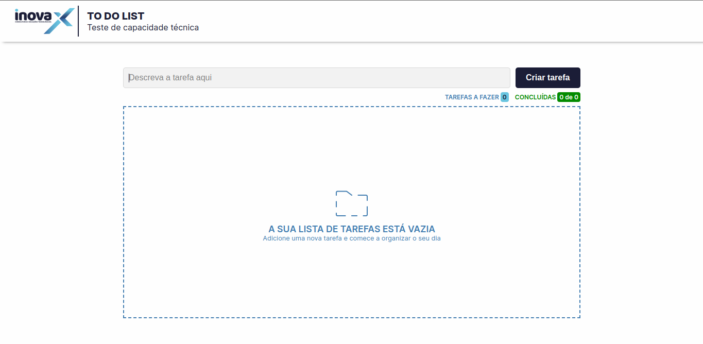
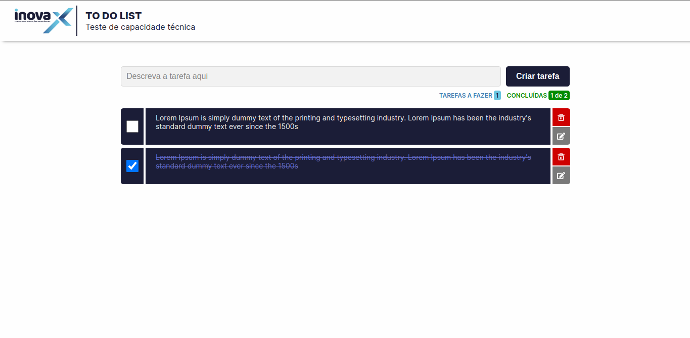
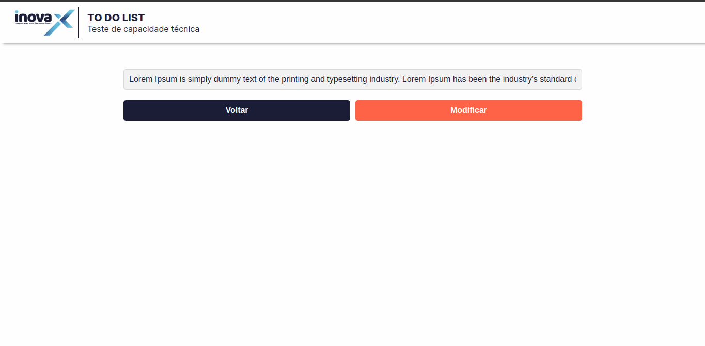

# To-Do List

Uma aplicação web para gerenciar suas tarefas diárias.

## Instalação

Clone o repositório para sua máquina local:

```
git clone https://github.com/Guilherme-Silva0/to-do-list.git
```

Instale as dependências necessárias com o seguinte comando:

```
npm install
```

## Execução

Para iniciar o projeto, execute o seguinte comando:

```
npm start
```

## Tecnologias utilizadas

- React
- React Router
- Session Storage
- Location Storage 
- UUID

## Recursos

- Adição de tarefas
- Marcação de tarefas concluídas
- Edição de tarefas
- Exclusão de tarefas
- Armazenamento de tarefas na sessão do navegador

## Screenshots

- Tela inicial sem tarefas:
  

- Tela inicial com tarefas:
  

- Tela de modificação de tarefas:
  

## Licença

Este projeto está licenciado sob a licença MIT.
